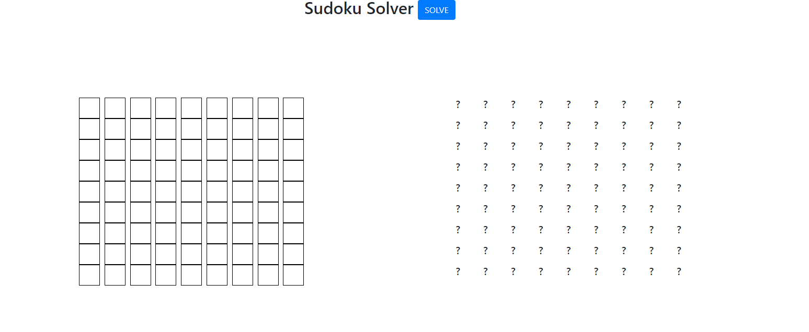

# Sudoku Resolver

The application uses JavaScript code to solve a Sudoku board. The algorithm needs up to one digit given by the user to solve a board. 

The application uses the Node.js startup environment and Express.js for user registration and login, which uses MongoDB for data storage and bcrypt for password hashing.
App is to perform initial user authorization based on the data entered into the request.md file. If they match, then it lets the user through to the application's home page.


## Run Locally

Clone the project

```bash
  git clone https://link-to-project
```

Go to the project directory

```bash
  cd my-project
```

Install dependencies

```bash
  npm install bcrypt, expreess, mongodb, mongoose
```

Start the server

```bash
  node index.js
```

Open browser, enter the server adress

```bash
  http://localhost:3000/users/login
```


## Screenshots



## Authors

- [@Dariusz Pazdur](https://www.github.com/DariuszPazdur17)


